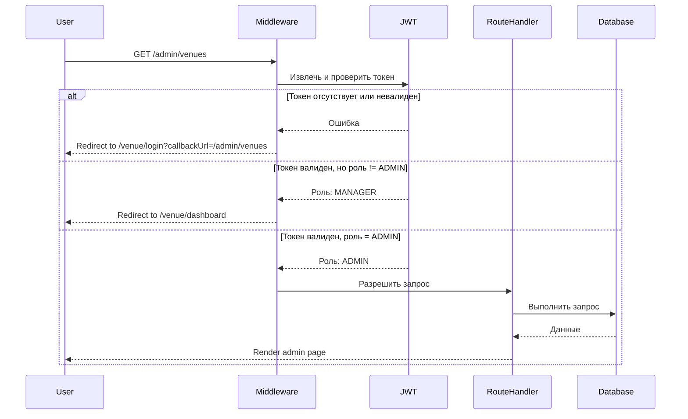
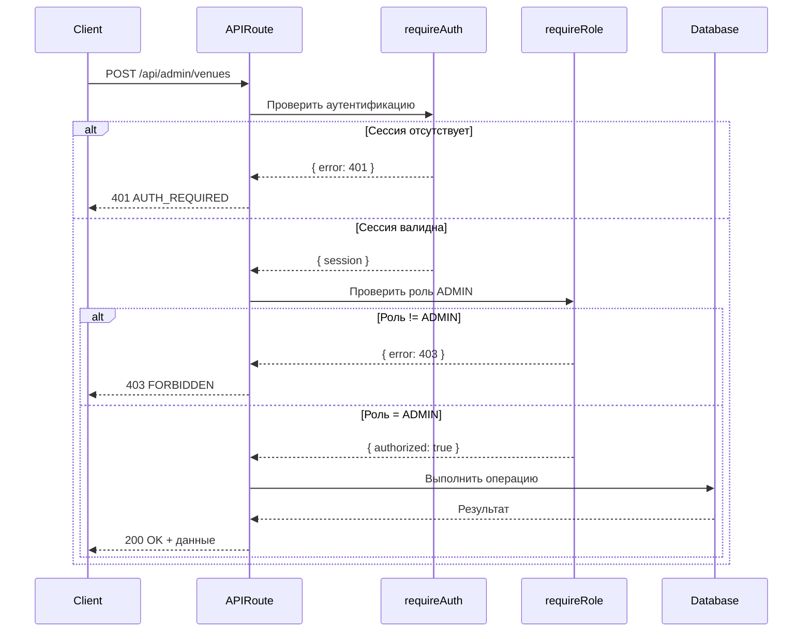

# Документ дизайна: Безопасность админ-панели

## Обзор

Этот дизайн описывает реализацию комплексной системы аутентификации и авторизации для админ-панели. Система использует существующую инфраструктуру NextAuth с JWT токенами и Next.js middleware для защиты всех маршрутов и API endpoints админки.

Ключевые компоненты:
- **Next.js Middleware**: Перехватывает запросы на уровне Edge runtime для быстрой проверки авторизации
- **API Middleware Functions**: Серверные функции для проверки аутентификации и авторизации в API routes
- **Client-side Guards**: React компоненты для предотвращения мигания контента
- **Comprehensive Testing**: Unit и property-based тесты для проверки всех аспектов безопасности

Система уже частично реализована - middleware защищает маршруты `/admin/*` и `/api/admin/*`, а API endpoints используют функции `requireAuth()` и `requireRole()`. Эта спецификация фокусируется на валидации существующей защиты, добавлении недостающих проверок и создании комплексных тестов.

## Архитектура

### Уровни защиты

Система использует многоуровневую защиту (defense in depth):

```
┌─────────────────────────────────────────────────────────────┐
│                    Client Request                            │
└─────────────────────────────────────────────────────────────┘
                            │
                            ▼
┌─────────────────────────────────────────────────────────────┐
│  Layer 1: Next.js Middleware (Edge Runtime)                  │
│  - Проверка JWT токена                                       │
│  - Проверка роли пользователя                                │
│  - Редирект неавторизованных пользователей                   │
└─────────────────────────────────────────────────────────────┘
                            │
                            ▼
┌─────────────────────────────────────────────────────────────┐
│  Layer 2: API Route Handlers (Node.js Runtime)               │
│  - requireAuth(): проверка сессии                            │
│  - requireRole(): проверка роли ADMIN                        │
│  - Возврат 401/403 при ошибках                               │
└─────────────────────────────────────────────────────────────┘
                            │
                            ▼
┌─────────────────────────────────────────────────────────────┐
│  Layer 3: Business Logic                                     │
│  - Выполнение административных операций                      │
│  - Доступ к базе данных                                      │
└─────────────────────────────────────────────────────────────┘
```

### Поток аутентификации



### Поток API авторизации



## Компоненты и интерфейсы

### 1. Next.js Middleware (`src/middleware.ts`)

**Существующая реализация:**
```typescript
// Уже реализовано в src/middleware.ts
const protectedRoutes: Record<string, string[]> = {
  '/admin': ['ADMIN'],
  '/api/admin': ['ADMIN'],
  // ... другие маршруты
}

export async function middleware(request: NextRequest) {
  // 1. Пропустить статические файлы и Next.js internals
  // 2. Разрешить публичные маршруты
  // 3. Проверить, является ли маршрут защищенным
  // 4. Извлечь JWT токен
  // 5. Проверить роль пользователя
  // 6. Редирект или разрешить доступ
}
```

**Валидация:**
- ✅ Middleware уже защищает `/admin/*` и `/api/admin/*`
- ✅ Использует `getToken()` для извлечения JWT в Edge runtime
- ✅ Проверяет роль и выполняет редирект на основе роли
- ⚠️ Требуется добавить тесты для проверки корректности работы

### 2. API Middleware Functions (`src/lib/api/middleware.ts`)

**Существующая реализация:**

```typescript
// Функция requireAuth
export async function requireAuth(): Promise<
  { session: ApiContext } | { error: NextResponse }
> {
  const session = await auth();
  if (!session?.user) {
    return {
      error: NextResponse.json<ApiErrorResponse>(
        { code: 'AUTH_REQUIRED', message: 'Authentication required' },
        { status: 401 }
      ),
    };
  }
  return { session: /* ApiContext */ };
}

// Функция requireRole
export function requireRole(
  session: ApiContext,
  allowedRoles: SessionUser['role'][]
): { authorized: true } | { error: NextResponse } {
  if (!allowedRoles.includes(session.userRole)) {
    return {
      error: NextResponse.json<ApiErrorResponse>(
        { code: 'FORBIDDEN', message: 'Insufficient permissions' },
        { status: 403 }
      ),
    };
  }
  return { authorized: true };
}
```

**Использование в admin API routes:**
```typescript
export async function GET(request: NextRequest) {
  // Проверка аутентификации
  const authResult = await requireAuth();
  if ('error' in authResult) return authResult.error;
  const { session } = authResult;

  // Проверка роли ADMIN
  const roleResult = requireRole(session, ['ADMIN']);
  if ('error' in roleResult) return roleResult.error;

  // Бизнес-логика
  // ...
}
```

**Валидация:**
- ✅ Все существующие admin API endpoints используют `requireAuth()` и `requireRole()`
- ✅ Возвращают правильные коды ошибок (401, 403)
- ✅ Используют согласованную структуру ошибок
- ⚠️ Требуется добавить тесты для проверки корректности работы

### 3. NextAuth Configuration (`src/lib/auth.ts`)

**Существующая реализация:**
```typescript
export const { handlers, signIn, signOut, auth } = NextAuth({
  providers: [Credentials({ /* ... */ })],
  session: { strategy: "jwt" },
  callbacks: {
    async jwt({ token, user }) {
      if (user) {
        token.id = user.id;
        token.role = user.role;
      }
      return token;
    },
    async session({ session, token }) {
      if (session.user) {
        session.user.id = token.id;
        session.user.role = token.role;
      }
      return session;
    },
  },
  pages: {
    signIn: "/venue/login",
    error: "/venue/login",
  },
  secret: process.env.NEXTAUTH_SECRET,
});
```

**Валидация:**
- ✅ JWT strategy используется для сессий
- ✅ Роль пользователя сохраняется в токене
- ✅ NEXTAUTH_SECRET используется для подписи токенов
- ✅ Страница входа настроена на `/venue/login`

### 4. Client-side Protection (Новый компонент)

Для предотвращения мигания контента на клиенте, создадим компонент-обертку:

```typescript
// src/components/admin/AdminGuard.tsx
'use client'

import { useSession } from 'next-auth/react'
import { useRouter } from 'next/navigation'
import { useEffect } from 'react'

interface AdminGuardProps {
  children: React.ReactNode
  loadingComponent?: React.ReactNode
}

export function AdminGuard({ children, loadingComponent }: AdminGuardProps) {
  const { data: session, status } = useSession()
  const router = useRouter()

  useEffect(() => {
    if (status === 'loading') return

    if (!session) {
      router.push('/venue/login?callbackUrl=/admin')
      return
    }

    if (session.user.role !== 'ADMIN') {
      // Редирект на основе роли
      if (session.user.role === 'MANAGER') {
        router.push('/venue/dashboard')
      } else if (session.user.role === 'STAFF') {
        router.push('/staff/dashboard')
      } else {
        router.push('/')
      }
    }
  }, [session, status, router])

  if (status === 'loading') {
    return loadingComponent || <div>Loading...</div>
  }

  if (!session || session.user.role !== 'ADMIN') {
    return null // Не показывать контент
  }

  return <>{children}</>
}
```

**Использование:**
```typescript
// src/app/admin/layout.tsx
import { AdminGuard } from '@/components/admin/AdminGuard'

export default function AdminLayout({ children }) {
  return (
    <AdminGuard>
      {children}
    </AdminGuard>
  )
}
```

## Модели данных

### JWT Token Structure

```typescript
interface JWTToken {
  id: string          // User ID
  role: 'ADMIN' | 'MANAGER' | 'STAFF'
  email: string
  iat: number         // Issued at
  exp: number         // Expiration
  jti: string         // JWT ID
}
```

### Session Structure

```typescript
interface Session {
  user: {
    id: string
    email: string
    role: 'ADMIN' | 'MANAGER' | 'STAFF'
  }
  expires: string     // ISO 8601 date string
}
```

### API Error Response

```typescript
interface ApiErrorResponse {
  code: 'AUTH_REQUIRED' | 'FORBIDDEN' | 'VALIDATION_ERROR' | 'NOT_FOUND'
  message: string
}
```

### API Context

```typescript
interface ApiContext {
  session: Session
  userId: string
  userRole: 'ADMIN' | 'MANAGER' | 'STAFF'
}
```


## Correctness Properties

*Свойство (property) - это характеристика или поведение, которое должно быть истинным для всех валидных выполнений системы - по сути, формальное утверждение о том, что система должна делать. Свойства служат мостом между человекочитаемыми спецификациями и машинно-проверяемыми гарантиями корректности.*

### Property 1: Unauthenticated UI redirect with callback

*Для любого* маршрута под `/admin/*`, когда неаутентифицированный пользователь пытается получить доступ, система должна перенаправить на `/venue/login` с параметром `callbackUrl`, содержащим исходный URL

**Validates: Requirements 1.1, 5.3**

### Property 2: Unauthenticated API rejection

*Для любого* API endpoint под `/api/admin/*`, когда запрос не содержит валидной аутентификации, система должна вернуть статус 401 с JSON структурой `{ code: 'AUTH_REQUIRED', message: string }`

**Validates: Requirements 1.2, 3.3, 5.1**

### Property 3: Role-based UI access control

*Для любого* маршрута под `/admin/*` и любой роли пользователя:
- Если роль = ADMIN, доступ должен быть разрешен
- Если роль = MANAGER, должен быть редирект на `/venue/dashboard`
- Если роль = STAFF, должен быть редирект на `/staff/dashboard`
- Если роль неизвестна, должен быть редирект на `/`

**Validates: Requirements 2.1, 2.2, 2.3, 2.4, 2.5**

### Property 4: Role-based API access control

*Для любого* API endpoint под `/api/admin/*` и любой роли пользователя:
- Если роль = ADMIN, запрос должен быть обработан
- Если роль != ADMIN, система должна вернуть статус 403 с JSON структурой `{ code: 'FORBIDDEN', message: string }`

**Validates: Requirements 3.2, 3.4, 5.2**

### Property 5: Middleware intercepts before rendering

*Для любого* защищенного маршрута админки, middleware должен выполнить проверку авторизации до того, как любой контент страницы будет отправлен клиенту

**Validates: Requirements 4.1, 6.4**

### Property 6: AdminGuard prevents content flash

*Для любого* состояния сессии (loading, unauthenticated, unauthorized), компонент AdminGuard не должен рендерить защищенный контент до подтверждения, что пользователь имеет роль ADMIN

**Validates: Requirements 4.4**

### Property 7: Consistent HTTP status codes

*Для любого* защищенного endpoint (UI или API):
- Отсутствие аутентификации должно возвращать статус 401
- Недостаточные права (валидная аутентификация, но неправильная роль) должны возвращать статус 403

**Validates: Requirements 5.4**

### Property 8: All admin routes are protected

*Для любого* маршрута, соответствующего паттерну `/admin/*` или `/api/admin/*`, система должна требовать аутентификацию и роль ADMIN перед предоставлением доступа

**Validates: Requirements 6.1, 6.2**

### Property 9: JWT token validation

*Для любого* JWT токена, система должна проверить:
- Подпись токена с использованием NEXTAUTH_SECRET
- Срок действия токена (exp claim)
- Если токен невалиден или истек, пользователь должен рассматриваться как неаутентифицированный

**Validates: Requirements 7.2, 7.3**

## Обработка ошибок

### Типы ошибок

1. **AUTH_REQUIRED (401)**
   - Причина: Отсутствует или невалидна аутентификация
   - UI поведение: Редирект на `/venue/login?callbackUrl=<original-url>`
   - API поведение: `{ code: 'AUTH_REQUIRED', message: 'Authentication required' }`

2. **FORBIDDEN (403)**
   - Причина: Валидная аутентификация, но недостаточные права (роль != ADMIN)
   - UI поведение: Редирект на dashboard пользователя на основе роли
   - API поведение: `{ code: 'FORBIDDEN', message: 'Insufficient permissions' }`

3. **SESSION_EXPIRED (401)**
   - Причина: JWT токен истек
   - UI поведение: Редирект на `/venue/login?callbackUrl=<current-url>`
   - API поведение: `{ code: 'AUTH_REQUIRED', message: 'Session expired' }`

### Error Handling Flow

```typescript
// Middleware error handling
if (!token) {
  // AUTH_REQUIRED - redirect to login
  return NextResponse.redirect(
    new URL(`/venue/login?callbackUrl=${pathname}`, request.url)
  )
}

if (!allowedRoles.includes(userRole)) {
  // FORBIDDEN - redirect based on role
  const redirectUrl = getRoleBasedRedirect(userRole)
  return NextResponse.redirect(new URL(redirectUrl, request.url))
}

// API error handling
if (!session?.user) {
  return NextResponse.json(
    { code: 'AUTH_REQUIRED', message: 'Authentication required' },
    { status: 401 }
  )
}

if (!allowedRoles.includes(session.userRole)) {
  return NextResponse.json(
    { code: 'FORBIDDEN', message: 'Insufficient permissions' },
    { status: 403 }
  )
}
```

### Client-side Error Handling

```typescript
// AdminGuard component
useEffect(() => {
  if (status === 'loading') return

  if (!session) {
    // AUTH_REQUIRED
    router.push(`/venue/login?callbackUrl=${pathname}`)
    return
  }

  if (session.user.role !== 'ADMIN') {
    // FORBIDDEN - redirect based on role
    const redirectUrl = getRoleBasedRedirect(session.user.role)
    router.push(redirectUrl)
  }
}, [session, status, router, pathname])
```

## Стратегия тестирования

### Dual Testing Approach

Система использует комбинацию unit тестов и property-based тестов для комплексного покрытия:

- **Unit тесты**: Проверяют конкретные примеры, edge cases и интеграционные точки
- **Property тесты**: Проверяют универсальные свойства на множестве сгенерированных входных данных

Оба типа тестов дополняют друг друга и необходимы для полного покрытия.

### Property-Based Testing Configuration

**Библиотека**: `fast-check` для TypeScript/JavaScript
**Минимальное количество итераций**: 100 на каждый property тест
**Формат тега**: `Feature: admin-panel-security, Property {number}: {property_text}`

### Test Categories

#### 1. Middleware Tests

**Unit Tests:**
- Проверка, что middleware пропускает статические файлы
- Проверка, что middleware пропускает публичные маршруты
- Проверка редиректа для конкретных ролей (MANAGER → /venue/dashboard)
- Проверка редиректа для конкретных ролей (STAFF → /staff/dashboard)
- Проверка, что middleware извлекает JWT без запросов к БД

**Property Tests:**
- Property 1: Для любого маршрута `/admin/*` без токена → редирект с callbackUrl
- Property 3: Для любого маршрута `/admin/*` с любой ролью → правильное поведение
- Property 5: Для любого защищенного маршрута → middleware выполняется первым
- Property 8: Для любого маршрута `/admin/*` → требуется аутентификация и роль ADMIN

#### 2. API Middleware Tests

**Unit Tests:**
- Проверка `requireAuth()` с отсутствующей сессией
- Проверка `requireAuth()` с валидной сессией
- Проверка `requireRole()` с правильной ролью
- Проверка `requireRole()` с неправильной ролью
- Проверка, что авторизация выполняется до бизнес-логики

**Property Tests:**
- Property 2: Для любого API endpoint без аутентификации → 401 AUTH_REQUIRED
- Property 4: Для любого API endpoint с неправильной ролью → 403 FORBIDDEN
- Property 7: Для любого endpoint → правильные HTTP коды статуса
- Property 8: Для любого API endpoint `/api/admin/*` → требуется аутентификация и роль ADMIN

#### 3. AdminGuard Component Tests

**Unit Tests:**
- Проверка отображения loading state во время проверки сессии
- Проверка редиректа при отсутствии сессии
- Проверка редиректа для роли MANAGER
- Проверка редиректа для роли STAFF
- Проверка рендеринга контента для роли ADMIN

**Property Tests:**
- Property 6: Для любого состояния (loading, unauthenticated, unauthorized) → контент не рендерится до авторизации

#### 4. JWT Token Validation Tests

**Unit Tests:**
- Проверка валидации токена с правильной подписью
- Проверка отклонения токена с неправильной подписью
- Проверка отклонения истекшего токена
- Проверка, что NEXTAUTH_SECRET используется для подписи

**Property Tests:**
- Property 9: Для любого JWT токена → проверка подписи и срока действия

#### 5. Integration Tests

**Unit Tests:**
- End-to-end тест: неаутентифицированный пользователь → login → admin panel
- End-to-end тест: MANAGER пытается получить доступ к админке → редирект
- End-to-end тест: ADMIN получает доступ ко всем страницам админки
- Проверка, что истекшая сессия вызывает редирект при следующем действии

### Test Implementation Guidelines

1. **Property тесты должны использовать генераторы:**
   ```typescript
   import fc from 'fast-check'
   
   // Генератор маршрутов админки
   const adminRouteArb = fc.string().map(s => `/admin/${s}`)
   
   // Генератор ролей
   const roleArb = fc.constantFrom('ADMIN', 'MANAGER', 'STAFF', 'UNKNOWN')
   ```

2. **Каждый property тест должен иметь тег:**
   ```typescript
   it('Feature: admin-panel-security, Property 1: Unauthenticated UI redirect with callback', () => {
     fc.assert(
       fc.property(adminRouteArb, (route) => {
         // Test implementation
       }),
       { numRuns: 100 }
     )
   })
   ```

3. **Unit тесты должны использовать моки для изоляции:**
   ```typescript
   jest.mock('next-auth/jwt', () => ({
     getToken: jest.fn()
   }))
   ```

4. **Тесты должны проверять как успешные, так и неуспешные сценарии**

### Test Coverage Goals

- **Middleware**: 100% покрытие всех веток
- **API Middleware Functions**: 100% покрытие всех веток
- **AdminGuard Component**: 100% покрытие всех состояний
- **Integration**: Покрытие всех критических user flows

### Continuous Testing

- Тесты должны запускаться при каждом commit (pre-commit hook)
- Property тесты должны запускаться в CI/CD pipeline
- Минимальный порог покрытия: 90% для всех компонентов безопасности
