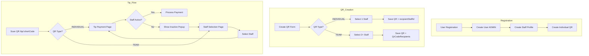

# Design Document: QR Code Types Refactoring

## Overview

Данный документ описывает архитектуру и технический дизайн для замены механики "Модель распределения чаевых" на новую систему QR-кодов двух типов: INDIVIDUAL и TEAM. Изменения затрагивают:
- Prisma schema (новые enum, таблица QrCodeRecipient)
- API endpoints (создание/редактирование QR, получение данных для tip page)
- Frontend (регистрация, настройки, страница QR-кодов, tip flow)
- Миграция существующих данных

## Architecture

### High-Level Flow



### Data Flow

```mermaid
sequenceDiagram
    participant Guest
    participant TipPage as /tip/:shortCode
    participant API as API /api/tip/:shortCode
    participant DB as Database
    
    Guest->>TipPage: Scan QR
    TipPage->>API: GET /api/tip/:shortCode
    API->>DB: Find QrCode by shortCode
    DB-->>API: QrCode + type + recipients
    
    alt INDIVIDUAL QR
        API-->>TipPage: {type: INDIVIDUAL, staff: {...}}
        TipPage->>Guest: Show Payment Page
    else TEAM QR
        API-->>TipPage: {type: TEAM, recipients: [...]}
        TipPage->>Guest: Show Staff Selection
        Guest->>TipPage: Select Staff
        TipPage->>Guest: Show Payment Page
    end


## Components and Interfaces

### 1. Database Schema Changes

#### New Enum: QrType
```prisma
enum QrType {
  INDIVIDUAL  // Replaces PERSONAL
  TEAM        // Replaces TABLE, VENUE
  // Legacy values kept for migration compatibility:
  PERSONAL    // @deprecated - migrated to INDIVIDUAL
  TABLE       // @deprecated - migrated to TEAM  
  VENUE       // @deprecated - migrated to TEAM
}
```

#### New Table: QrCodeRecipient
```prisma
model QrCodeRecipient {
  id        String   @id @default(cuid())
  createdAt DateTime @default(now())
  
  qrCodeId  String
  qrCode    QrCode   @relation(fields: [qrCodeId], references: [id], onDelete: Cascade)
  
  staffId   String
  staff     Staff    @relation(fields: [staffId], references: [id], onDelete: Cascade)
  
  @@unique([qrCodeId, staffId])
  @@index([qrCodeId])
  @@index([staffId])
}
```

#### Modified Model: QrCode
```prisma
model QrCode {
  id        String   @id @default(cuid())
  type      QrType   // INDIVIDUAL or TEAM
  label     String?
  status    QrStatus @default(ACTIVE)
  shortCode String   @unique
  createdAt DateTime @default(now())
  updatedAt DateTime @updatedAt

  venueId   String
  venue     Venue    @relation(fields: [venueId], references: [id])
  
  // For INDIVIDUAL QR - direct staff reference
  staffId   String?  @unique
  staff     Staff?   @relation("StaffQr", fields: [staffId], references: [id])
  
  // For TEAM QR - many-to-many via QrCodeRecipient
  recipients QrCodeRecipient[]
  
  tips      Tip[]

  @@index([venueId])
  @@index([shortCode])
}
```

#### Modified Model: Staff
```prisma
model Staff {
  // ... existing fields ...
  
  qrCode      QrCode?          @relation("StaffQr")
  teamQrCodes QrCodeRecipient[] // Staff can be recipient in multiple Team QRs
  
  // ... rest of relations ...
}
```

### 2. API Endpoints

#### POST /api/qr - Create QR Code
```typescript
interface CreateQrRequest {
  venueId: string;
  type: 'INDIVIDUAL' | 'TEAM';
  label: string;
  // For INDIVIDUAL:
  staffId?: string;
  // For TEAM:
  recipientStaffIds?: string[];
}

interface CreateQrResponse {
  qrCode: {
    id: string;
    type: 'INDIVIDUAL' | 'TEAM';
    shortCode: string;
    label: string;
    staff?: Staff;           // For INDIVIDUAL
    recipients?: Staff[];    // For TEAM
  };
}
```

#### GET /api/tip/:shortCode - Get QR Data for Tip Page
```typescript
interface TipQrResponse {
  id: string;
  type: 'INDIVIDUAL' | 'TEAM';
  label: string | null;
  venue: {
    id: string;
    name: string;
    logoUrl: string | null;
  };
  // For INDIVIDUAL QR:
  staff: Staff | null;
  // For TEAM QR:
  recipients: Staff[];  // Only active staff
}
```

#### PATCH /api/qr/:id - Update Team QR Recipients
```typescript
interface UpdateTeamQrRequest {
  recipientStaffIds: string[];  // Minimum 2
}
```

### 3. Frontend Components

#### QrCreateForm Component
```typescript
interface QrCreateFormProps {
  venueId: string;
  staffList: Staff[];
  onSuccess: (qr: QrCode) => void;
}

// States:
// 1. Type selection (INDIVIDUAL / TEAM)
// 2. Staff selection (single for INDIVIDUAL, multi for TEAM)
// 3. Label input
// 4. Submit
```

#### StaffSelectionPage Component (for TEAM QR)
```typescript
interface StaffSelectionPageProps {
  qrData: TipQrResponse;
  onStaffSelect: (staffId: string) => void;
}

// Displays grid of active recipients with:
// - Avatar (or placeholder)
// - Display name
// - Role
```

#### InactiveStaffPopup Component
```typescript
interface InactiveStaffPopupProps {
  isOpen: boolean;
  onClose: () => void;  // Redirects to staff selection
  message: string;      // "Выберите другого сотрудника!"
}
```

## Data Models

### QR Code Type Determination Logic

```typescript
function getQrTypeForTipPage(qrCode: QrCode): 'payment' | 'selection' {
  if (qrCode.type === 'INDIVIDUAL') {
    return 'payment';  // Go directly to payment
  }
  if (qrCode.type === 'TEAM') {
    return 'selection';  // Show staff selection first
  }
  // Legacy types (during migration period):
  if (qrCode.type === 'PERSONAL') {
    return 'payment';
  }
  // TABLE, VENUE -> selection
  return 'selection';
}
```

### Staff Activity Check

```typescript
function isStaffAvailable(staff: Staff): boolean {
  return staff.status === 'ACTIVE';
}

function getActiveRecipients(qrCode: QrCode): Staff[] {
  if (qrCode.type === 'INDIVIDUAL') {
    return qrCode.staff && isStaffAvailable(qrCode.staff) 
      ? [qrCode.staff] 
      : [];
  }
  return qrCode.recipients
    .map(r => r.staff)
    .filter(isStaffAvailable);
}
```

### Registration Auto-Creation Logic

```typescript
async function createOwnerStaffAndQr(
  tx: PrismaTransaction,
  user: User,
  venue: Venue
): Promise<{ staff: Staff; qrCode: QrCode }> {
  // 1. Create Staff profile for owner
  const staff = await tx.staff.create({
    data: {
      displayName: venue.name,
      role: 'ADMINISTRATOR',
      status: 'ACTIVE',
      participatesInPool: true,
      venueId: venue.id,
      userId: user.id,
    },
  });
  
  // 2. Create Individual QR for owner
  const qrCode = await tx.qrCode.create({
    data: {
      type: 'INDIVIDUAL',
      label: venue.name,
      shortCode: generateShortCode(),
      status: 'ACTIVE',
      venueId: venue.id,
      staffId: staff.id,
    },
  });
  
  return { staff, qrCode };
}
```

### Migration Strategy

```typescript
// Migration rules:
// 1. PERSONAL -> INDIVIDUAL (keep staffId)
// 2. TABLE -> TEAM (create QrCodeRecipient for all active staff)
// 3. VENUE -> TEAM (create QrCodeRecipient for all active staff)

async function migrateQrCodes(prisma: PrismaClient) {
  // Step 1: Migrate PERSONAL to INDIVIDUAL
  await prisma.qrCode.updateMany({
    where: { type: 'PERSONAL' },
    data: { type: 'INDIVIDUAL' },
  });
  
  // Step 2: Migrate TABLE/VENUE to TEAM with recipients
  const tableVenueQrs = await prisma.qrCode.findMany({
    where: { type: { in: ['TABLE', 'VENUE'] } },
    include: { venue: { include: { staff: true } } },
  });
  
  for (const qr of tableVenueQrs) {
    const activeStaff = qr.venue.staff.filter(s => s.status === 'ACTIVE');
    
    // Create QrCodeRecipient entries
    await prisma.qrCodeRecipient.createMany({
      data: activeStaff.map(staff => ({
        qrCodeId: qr.id,
        staffId: staff.id,
      })),
    });
    
    // Update QR type
    await prisma.qrCode.update({
      where: { id: qr.id },
      data: { type: 'TEAM' },
    });
  }
}
```


## Correctness Properties

*A property is a characteristic or behavior that should hold true across all valid executions of a system—essentially, a formal statement about what the system should do. Properties serve as the bridge between human-readable specifications and machine-verifiable correctness guarantees.*

### Property 1: Individual QR requires exactly one staff
*For any* Individual QR creation request, the system shall accept it only if exactly one staffId is provided, and the created QR shall have that staffId stored as recipientStaffId.
**Validates: Requirements 2.2, 2.5**

### Property 2: Team QR requires minimum 2 recipients
*For any* Team QR creation request, the system shall accept it only if at least 2 staffIds are provided in recipientStaffIds array.
**Validates: Requirements 3.2**

### Property 3: Individual QR leads directly to payment
*For any* Individual QR with active staff, when accessed via /tip/:shortCode, the API response shall indicate type=INDIVIDUAL and include the staff data, enabling direct navigation to payment page.
**Validates: Requirements 2.4, 8.3**

### Property 4: Team QR leads to staff selection
*For any* Team QR, when accessed via /tip/:shortCode, the API response shall indicate type=TEAM and include the recipients array, enabling staff selection page display.
**Validates: Requirements 3.5, 8.2**

### Property 5: Only active staff shown in Team QR selection
*For any* Team QR with recipients, the API shall return only those recipients whose status is ACTIVE, excluding any inactive staff from the selection list.
**Validates: Requirements 4.1, 4.5, 11.4**

### Property 6: QR type cannot be changed after creation
*For any* existing QR code, update requests that attempt to change the type (INDIVIDUAL to TEAM or vice versa) shall be rejected with validation error.
**Validates: Requirements 2.6, 3.8**

### Property 7: Inactive staff triggers popup
*For any* tip payment request targeting an inactive staff member, the system shall return an error indicating staff is inactive, triggering the popup display.
**Validates: Requirements 5.1**

### Property 8: Registration creates owner staff and QR
*For any* successful venue registration, the system shall create: (1) User with role ADMIN, (2) Staff profile linked to user with displayName=venueName and role=ADMINISTRATOR, (3) Individual QR linked to that staff with label=venueName.
**Validates: Requirements 6.1, 6.2, 6.3, 6.4, 6.5, 6.7**

### Property 9: Migration preserves shortCodes
*For any* QR code that exists before migration, after migration the shortCode value shall remain unchanged, ensuring URL compatibility.
**Validates: Requirements 7.5, 8.4**

### Property 10: Migration converts types correctly
*For any* QR code with type PERSONAL, migration shall change type to INDIVIDUAL preserving staffId. *For any* QR code with type TABLE or VENUE, migration shall change type to TEAM and create QrCodeRecipient records for all active venue staff.
**Validates: Requirements 7.1, 7.2, 7.3, 7.4**

### Property 11: Migration preserves tip data
*For any* Tip or TipAllocation record that exists before migration, after migration the record shall still exist with unchanged data.
**Validates: Requirements 9.2, 9.3**

### Property 12: New QR creation ignores distribution fields
*For any* QR creation request, the system shall not use distributionMode or allowStaffChoice fields from venue settings to determine behavior; only QR type shall determine the flow.
**Validates: Requirements 10.1, 10.2, 10.3**

### Property 13: New tips always PERSONAL type
*For any* new tip created through the system, the TipType shall be set to PERSONAL regardless of QR type or venue settings.
**Validates: Requirements 10.6**

### Property 14: Team QR minimum recipients on edit
*For any* Team QR edit request that removes recipients, the system shall reject the request if it would result in fewer than 2 recipients remaining.
**Validates: Requirements 11.3**

### Property 15: QrCodeRecipient unique constraint
*For any* attempt to create a QrCodeRecipient with a (qrCodeId, staffId) pair that already exists, the system shall reject with unique constraint violation.
**Validates: Requirements 12.4**

### Property 16: QrCodeRecipient cascade delete
*For any* Team QR that is deleted, all related QrCodeRecipient records shall be automatically deleted via cascade.
**Validates: Requirements 12.5**

### Property 17: Registration ignores distributionMode
*For any* registration request that includes distributionMode parameter, the system shall ignore it and not store it as part of the new venue creation flow.
**Validates: Requirements 10.4**

### Property 18: Settings API ignores distribution fields
*For any* venue settings update request that includes distributionMode or allowStaffChoice, the system shall ignore these fields and not update them.
**Validates: Requirements 10.5**

## Error Handling

### API Error Responses

| Error Code | HTTP Status | Description |
|------------|-------------|-------------|
| `INVALID_QR_TYPE` | 400 | QR type must be INDIVIDUAL or TEAM |
| `INDIVIDUAL_REQUIRES_STAFF` | 400 | Individual QR requires exactly one staffId |
| `TEAM_REQUIRES_MIN_RECIPIENTS` | 400 | Team QR requires at least 2 recipients |
| `STAFF_NOT_FOUND` | 404 | Specified staff member not found |
| `STAFF_INACTIVE` | 400 | Staff member is inactive, cannot receive tips |
| `QR_NOT_FOUND` | 404 | QR code with given shortCode not found |
| `QR_INACTIVE` | 400 | QR code has been deactivated |
| `VENUE_NOT_ACCEPTING` | 400 | Venue is not accepting tips (all recipients inactive) |
| `TYPE_CHANGE_NOT_ALLOWED` | 400 | Cannot change QR type after creation |
| `MIN_RECIPIENTS_REQUIRED` | 400 | Cannot remove recipients below minimum of 2 |

### Edge Cases

1. **All Team QR recipients inactive**: Show error message "Venue is not accepting tips at the moment"
2. **Individual QR staff inactive**: Show popup "Выберите другого сотрудника!" and redirect to error page (no selection available)
3. **Migration with no active staff**: Create Team QR with empty recipients (will show error on scan)
4. **Duplicate QrCodeRecipient**: Silently ignore or return conflict error

## Testing Strategy

### Unit Tests
- QR creation validation (type, staffId, recipientStaffIds)
- Staff activity filtering logic
- Migration type conversion logic
- Registration auto-creation logic

### Property-Based Tests
- Property 1-18 as defined above
- Use fast-check library for TypeScript
- Minimum 100 iterations per property
- Tag format: **Feature: qr-code-types-refactoring, Property N: {property_text}**

### Integration Tests
- Full registration flow with auto QR creation
- QR creation API with database verification
- Tip flow for Individual and Team QR
- Migration script execution

### E2E Tests (Manual QA)
- Registration → QR visible in dashboard
- Create Individual QR → scan → payment page
- Create Team QR → scan → selection → payment
- Inactive staff popup behavior
- Existing QR URLs continue working after migration
