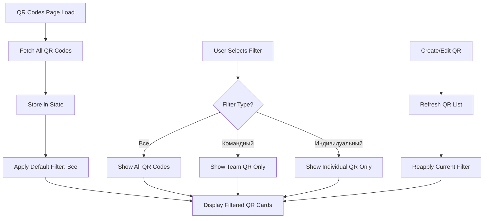

# Design Document: QR Codes Filtering

## Overview

Добавление клиентской фильтрации QR-кодов по типу на странице QR-codes в venue dashboard. Реализация использует shadcn/ui Tabs компонент для переключения между фильтрами и выполняет фильтрацию на клиенте без дополнительных API запросов.

## Architecture

### High-Level Flow



### Component Structure

```
QrCodesPage
├── Header (title + "Создать QR" button)
├── FilterTabs (NEW)
│   ├── Tab: Все
│   ├── Tab: Командный QR
│   └── Tab: Индивидуальный QR
├── QR Cards Grid (filtered)
│   └── QR Card (existing)
└── QR Generator (existing)
```

## Components and Interfaces

### 1. Filter State Management

```typescript
// Filter type
type QrFilter = 'all' | 'team' | 'individual';

// Component state
const [activeFilter, setActiveFilter] = useState<QrFilter>('all');
const [qrCodes, setQrCodes] = useState<QrCodeType[]>([]);

// Filtered QR codes (computed)
const filteredQrCodes = useMemo(() => {
  if (activeFilter === 'all') {
    return qrCodes;
  }
  
  if (activeFilter === 'team') {
    return qrCodes.filter(qr => 
      qr.type === 'TEAM' || qr.type === 'TABLE' || qr.type === 'VENUE'
    );
  }
  
  if (activeFilter === 'individual') {
    return qrCodes.filter(qr => 
      qr.type === 'INDIVIDUAL' || qr.type === 'PERSONAL'
    );
  }
  
  return qrCodes;
}, [qrCodes, activeFilter]);
```

### 2. Filter Tabs Component

```typescript
import { Tabs, TabsList, TabsTrigger } from '@/components/ui/tabs';

function QrFilterTabs({ 
  activeFilter, 
  onFilterChange 
}: {
  activeFilter: QrFilter;
  onFilterChange: (filter: QrFilter) => void;
}) {
  return (
    <Tabs value={activeFilter} onValueChange={onFilterChange}>
      <TabsList className="grid w-full grid-cols-3 max-w-md">
        <TabsTrigger value="all">Все</TabsTrigger>
        <TabsTrigger value="team">Командный QR</TabsTrigger>
        <TabsTrigger value="individual">Индивидуальный QR</TabsTrigger>
      </TabsList>
    </Tabs>
  );
}
```

### 3. Empty State Component

```typescript
function QrEmptyState({ 
  filter, 
  onCreateClick 
}: {
  filter: QrFilter;
  onCreateClick: () => void;
}) {
  const messages = {
    all: 'У вас пока нет QR-кодов',
    team: 'У вас пока нет командных QR-кодов',
    individual: 'У вас пока нет индивидуальных QR-кодов',
  };
  
  return (
    <Card className="glass">
      <CardContent className="py-12 text-center">
        <QrCode className="h-12 w-12 mx-auto text-muted-foreground/50 mb-3" />
        <p className="text-muted-foreground mb-4">{messages[filter]}</p>
        <Button onClick={onCreateClick} className="gap-2">
          <Plus className="h-4 w-4" />
          Создать QR
        </Button>
      </CardContent>
    </Card>
  );
}
```

### 4. Updated QrCodesPage Component

```typescript
export default function QrCodesPage() {
  const [qrCodes, setQrCodes] = useState<QrCodeType[]>([]);
  const [activeFilter, setActiveFilter] = useState<QrFilter>('all');
  const [showCreateDialog, setShowCreateDialog] = useState(false);
  // ... other state ...

  // Filtered QR codes
  const filteredQrCodes = useMemo(() => {
    if (activeFilter === 'all') return qrCodes;
    
    if (activeFilter === 'team') {
      return qrCodes.filter(qr => 
        qr.type === 'TEAM' || qr.type === 'TABLE' || qr.type === 'VENUE'
      );
    }
    
    return qrCodes.filter(qr => 
      qr.type === 'INDIVIDUAL' || qr.type === 'PERSONAL'
    );
  }, [qrCodes, activeFilter]);

  return (
    <div className="p-4 md:p-6 space-y-6 max-w-6xl">
      {/* Header */}
      <div className="flex items-center justify-between">
        <div>
          <h1 className="text-2xl font-heading font-bold">{t("title")}</h1>
          <p className="text-muted-foreground">{t("subtitle")}</p>
        </div>
        <Button onClick={() => setShowCreateDialog(true)} className="gap-2">
          <Plus className="h-4 w-4" />
          Создать QR
        </Button>
      </div>

      {/* Filter Tabs - NEW */}
      {qrCodes.length > 0 && (
        <QrFilterTabs 
          activeFilter={activeFilter} 
          onFilterChange={setActiveFilter} 
        />
      )}

      {/* QR Codes List */}
      {filteredQrCodes.length > 0 ? (
        <div className="grid gap-6 md:grid-cols-2">
          {filteredQrCodes.map((qr) => (
            <QrCard key={qr.id} qr={qr} {...otherProps} />
          ))}
        </div>
      ) : (
        <QrEmptyState 
          filter={activeFilter} 
          onCreateClick={() => setShowCreateDialog(true)} 
        />
      )}

      {/* Rest of the component... */}
    </div>
  );
}
```

## Data Models

### Filter Logic

```typescript
// Type guard functions
function isTeamQr(type: string): boolean {
  return type === 'TEAM' || type === 'TABLE' || type === 'VENUE';
}

function isIndividualQr(type: string): boolean {
  return type === 'INDIVIDUAL' || type === 'PERSONAL';
}

// Filter function
function filterQrCodes(
  qrCodes: QrCodeType[], 
  filter: QrFilter
): QrCodeType[] {
  switch (filter) {
    case 'all':
      return qrCodes;
    case 'team':
      return qrCodes.filter(qr => isTeamQr(qr.type));
    case 'individual':
      return qrCodes.filter(qr => isIndividualQr(qr.type));
    default:
      return qrCodes;
  }
}
```

### Filter State Persistence

```typescript
// Filter state persists during component lifecycle
// Resets on page refresh (no localStorage needed for MVP)

// After QR creation/edit, maintain filter
const handleQrCreated = () => {
  setShowCreateDialog(false);
  fetchQrCodes(); // Refresh list
  // activeFilter state is maintained automatically
};

const handleQrUpdated = () => {
  setEditingQr(null);
  fetchQrCodes(); // Refresh list
  // activeFilter state is maintained automatically
};
```

## Correctness Properties

*A property is a characteristic or behavior that should hold true across all valid executions of a system—essentially, a formal statement about what the system should do. Properties serve as the bridge between human-readable specifications and machine-verifiable correctness guarantees.*

### Property 1: All filter shows all QR codes
*For any* list of QR codes, when the "Все" filter is active, the displayed list shall contain all QR codes from the original list.
**Validates: Requirements 1.2, 1.3**

### Property 2: Team filter shows only team QR codes
*For any* list of QR codes, when the "Командный QR" filter is active, the displayed list shall contain only QR codes with type TEAM, TABLE, or VENUE.
**Validates: Requirements 2.1, 2.2, 2.3**

### Property 3: Individual filter shows only individual QR codes
*For any* list of QR codes, when the "Индивидуальный QR" filter is active, the displayed list shall contain only QR codes with type INDIVIDUAL or PERSONAL.
**Validates: Requirements 3.1, 3.2, 3.3**

### Property 4: Filter switching is immediate
*For any* filter change, the UI shall update the displayed QR codes without making additional API calls.
**Validates: Requirements 8.1, 8.2**

### Property 5: Empty state shows correct message
*For any* filter that returns zero results, the empty state message shall correspond to the active filter type.
**Validates: Requirements 6.1, 6.2**

### Property 6: Filter state persists during operations
*For any* QR creation or edit operation, after the operation completes and the list refreshes, the active filter shall remain the same as before the operation.
**Validates: Requirements 5.2, 5.3**

### Property 7: All QR actions work with filters
*For any* filtered QR code displayed, all actions (download, open, edit) shall function correctly regardless of which filter is active.
**Validates: Requirements 7.1**

## Error Handling

### Edge Cases

1. **No QR codes exist**: Show empty state with "Все" filter active
2. **Filter returns empty results**: Show filter-specific empty state message
3. **All QR codes are one type**: Other filter tabs still accessible, show empty state when selected
4. **Rapid filter switching**: Use useMemo to prevent unnecessary re-renders

### Responsive Behavior

```typescript
// Mobile (375px): Stack filter tabs vertically if needed
// Tablet (768px): Horizontal tabs with adequate spacing
// Desktop (1440px): Horizontal tabs with comfortable spacing

<TabsList className="grid w-full grid-cols-3 max-w-md">
  {/* Responsive grid that works on all screen sizes */}
</TabsList>
```

## Testing Strategy

### Unit Tests
- Filter logic functions (isTeamQr, isIndividualQr, filterQrCodes)
- Empty state message selection
- Filter state management

### Property-Based Tests
- Property 1-7 as defined above
- Use fast-check library for TypeScript
- Minimum 100 iterations per property
- Tag format: **Feature: qr-codes-filtering, Property N: {property_text}**

### Integration Tests
- Filter tabs interaction
- QR list updates after filtering
- Empty state display
- Filter persistence during create/edit operations

### Visual/Manual Tests
- Responsive design on 375px, 768px, 1440px
- Filter tab styling and active state
- Smooth transitions between filters
- Empty state appearance
- No console errors

## UI/UX Considerations

### Visual Design
- Use shadcn/ui Tabs component for consistency
- Active tab should have clear visual distinction
- Maintain spacing and alignment with existing design
- Smooth transitions (no jarring layout shifts)

### Accessibility
- Keyboard navigation between tabs
- ARIA labels for screen readers
- Focus indicators on tab elements
- Semantic HTML structure

### Performance
- Client-side filtering (no API calls)
- useMemo for filtered list computation
- Prevent unnecessary re-renders
- Smooth filter switching (<16ms)

## Implementation Notes

### Files to Modify
- `src/app/venue/(dashboard)/qr-codes/page.tsx` - Main page component

### New Components (optional, can be inline)
- Filter tabs (can be inline in page.tsx)
- Empty state (can be inline in page.tsx)

### Dependencies
- No new dependencies needed
- Uses existing shadcn/ui Tabs component
- Uses existing React hooks (useState, useMemo)

### Backward Compatibility
- No breaking changes
- All existing functionality remains intact
- Filter is additive feature
